# Exercise 03: Getting Access to HCP Cloud Foundry Services (Beta)

##Estimated time

10 min

##Objective

In this exercise you'll learn how to get access to HCP, starter edition for Cloud Foundry services (beta).

#Exercise description

You can get access to HCP Cloud Foundry by subscribing to the ```HCP, starter edition for Cloud Foundry services (beta)``` package on  the SAP Hybris as a Service (YaaS) marketplace. For this, you need to first sign in to YaaS so that you have a user there and are able to subscribe to packages provided on the YaaS marketplace. Afterwards you can subscribe to the HCP package available there. Finally, you will connect to your newly created Cloud Foundry organization and space and have a look into the administration cockpit.

## 1. Create a YaaS account and organization  

Execute this section if you have no user registered yet at yaas.io. If you already have a user, sign in with your user in yaas.io and make sure that you have an ```Organization``` created there (see steps 4 to 6 below).  

1. Go to ```https://yaas.io``` and go to ```Account``` > ```Register```.
<br><br>
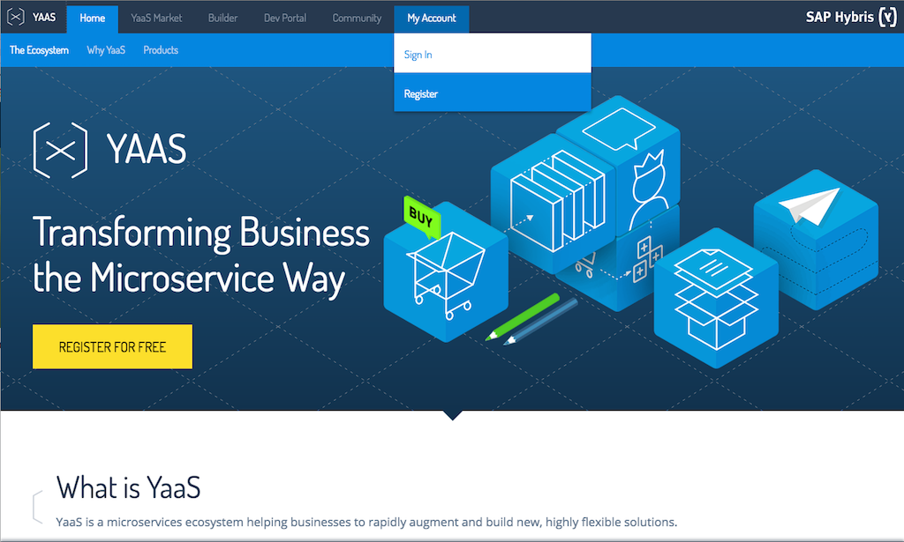
<br><br>

2. On the user registration page, fill out the fields, check the Terms-of-Use checkbox and click ```Register```. In case you already have a user registered at YaaS, you can skip this step as well as step 3 and directly choose ```Sign In``` to log in with your existing YaaS user.
<br><br>
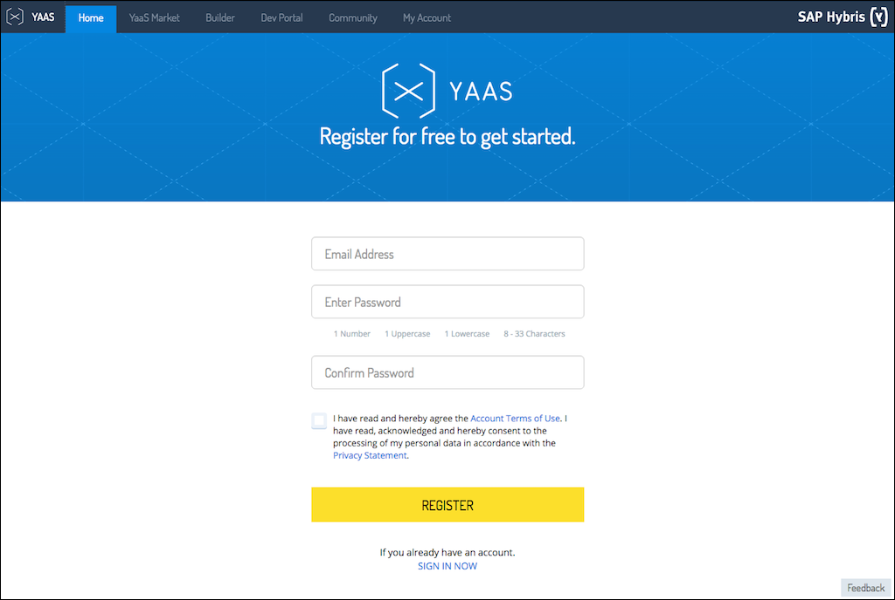
<br><br>

3. YaaS sends you a confirmation email to your email address. Open the email and click ```Confirm```. Note that registering a user at yaas.io is free of charge.
<br><br>
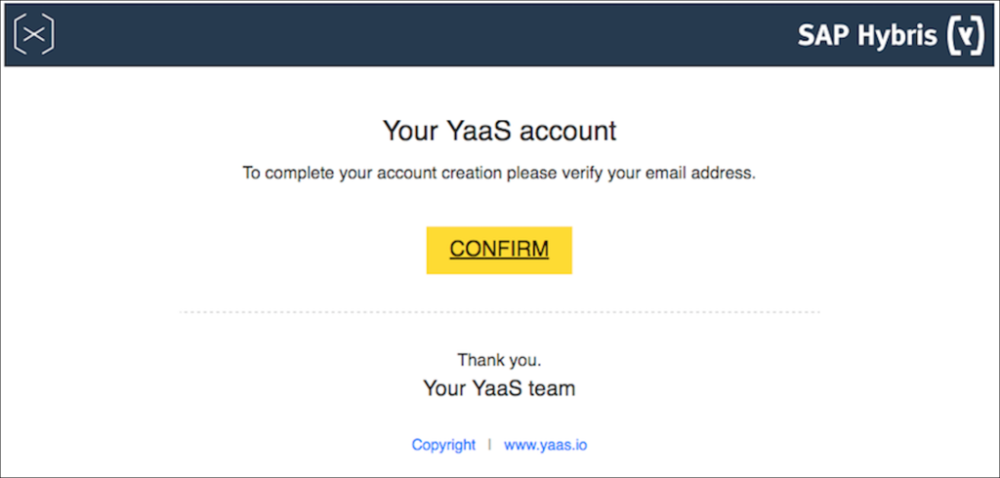
<br><br>

4. Now you have a user registered at yaas.io and get redirected to the Welcome page shown below. YaaS allows you to publish and sell business services on the YaaS marketplace, and to consume existing business services offered there. YaaS takes care for the metering and billing of the used services. In order to work with YaaS, you need an organization first. An organization in the YaaS world represents a customer and holds the billing information for productive accounts. To create an organization, click the ```Create Organization``` button.   
<br><br>
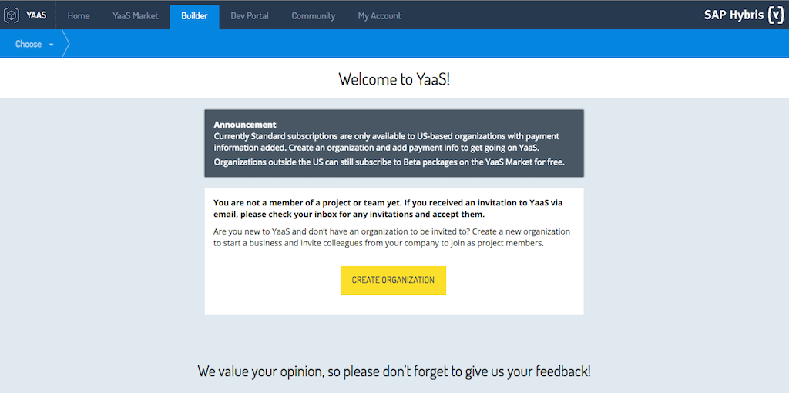
<br><br>

5. Fill out the fields as suggested in the screenshot below: as ```Legal Name``` chose ```dev262_<your_user_name>```, as ```Your YaaS URL``` chose ```dev262<your_user_name>```, and as ```Purpose of Use``` chose ```Non-commercial```. Finally click ```Save``` on the upper right corner.
<br><br>
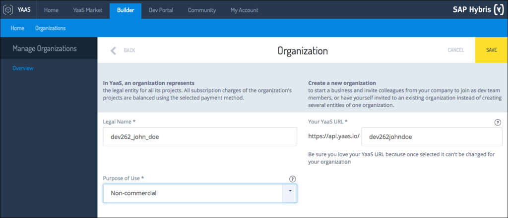
<br><br>

6. You have now a non-commercial YaaS organization created and can continue to subscribe to existing offerings on the YaaS marketplace.
<br><br>
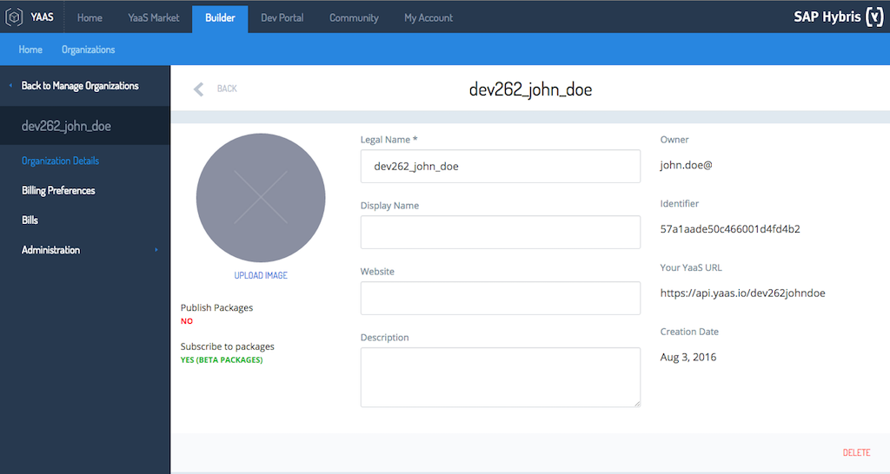
<br><br>

## 2. Subscribe to the HCP package in the YaaS marketplace

Now that you have a YaaS user registered and organization created, you can navigate to the ```YaaS Market``` tab and subscribe to products offered there.

1. Navigate into the ```Yaas Market``` tab (direct URL is ```https://market.yaas.io```).
<br><br>
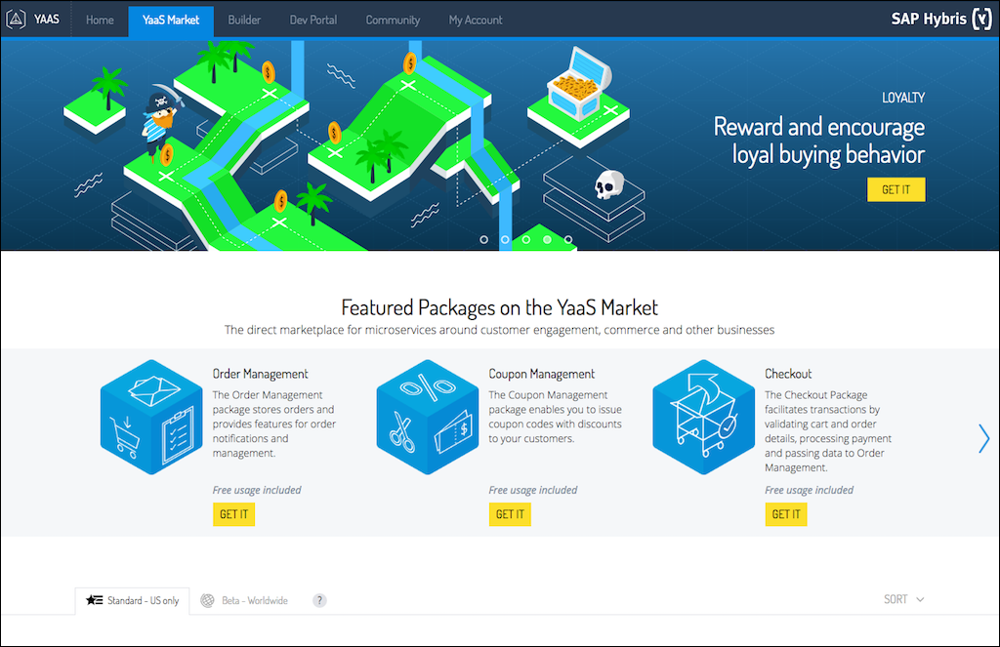
<br><br>

2. Go into the ```Beta-Worldwide```tab. This tab contains products which can be used for non-productive usage and are free of charge.
You can find there the package ```HCP, Starter Edition for Cloud Foundry```. Click on it to get to the package details page.
<br><br>
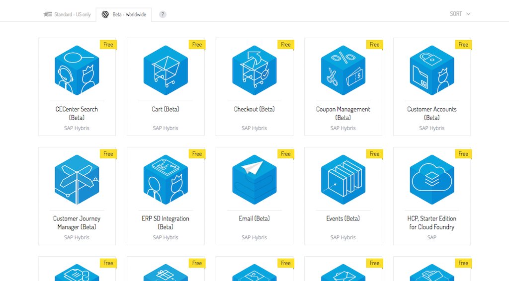
<br><br>

3. In the HCP Cloud Foundry package details page, you can find information about the package content. Have a look at it and then click the ```Subscribe Now```button.
<br><br>

<br><br>

4. As each subscription in YaaS lives in the context of a YaaS project, you get now asked to create or assign a project. As name and identifier enter ```<yourname>project```. Then click ```Create```.
<br><br>

<br><br>

5. On the ```Your Project```page, click the ```Continue``` button.
<br><br>
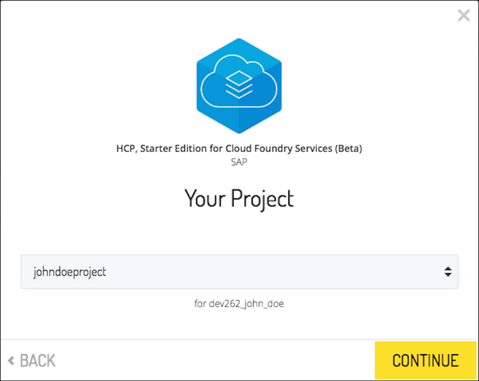
<br><br>

6. In the ```Subscription Preview```page, you can again open and read the Terms-of-Use. Finally click the ```Subscribe Now```button.   
<br><br>
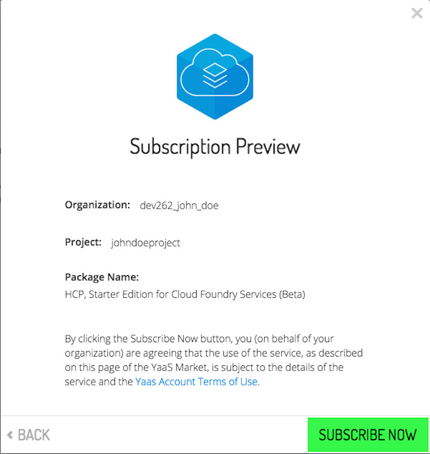
<br><br>

7. On the next page, simply click the ```Configure It``` button. This leads you to the so-called YaaS builder module of the HCP Cloud Foundry package that you have just subscribed to. A builder module is the back office UI of a service registered at YaaS.   
<br><br>
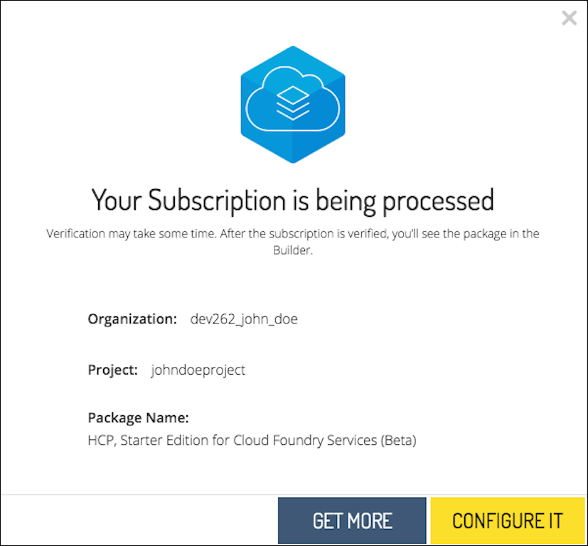
<br><br>

8. On the HCP Cloud Foundry builder module, you see information about the new Cloud Foundry organization and space that will be created in the next step. You can change here the name of the Cloud Foundry space if you wish. Then click the ```Create``` button. This will  create a Cloud Foundry organization and space with your user as OrgManager on the fly.    
<br><br>
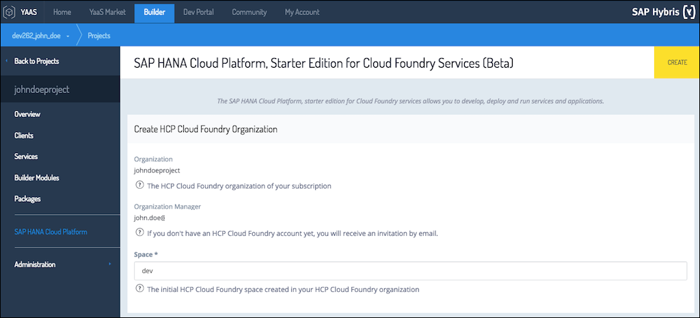
<br><br>

9. The UI of the builder module will now change and you see information about the newly created Cloud Foundry org/space, as well as some ```Getting Started``` information. You also find a ```Manage HCP Applications``` button on the lower right corner which brings you to the HCP cloud cockpit which the administration tool for Cloud Foundry, too.
<br><br>
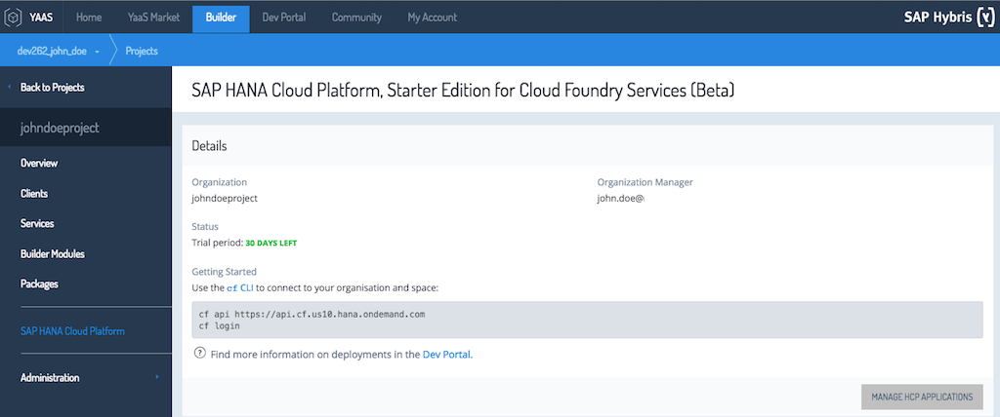
<br><br>

10. If your user is using HCP Cloud Foundry services for the very first time, a confirmation email from HCP is sent to your email again. You need to confirm this email before you can log on to your Cloud Foundry account.
<br><br>
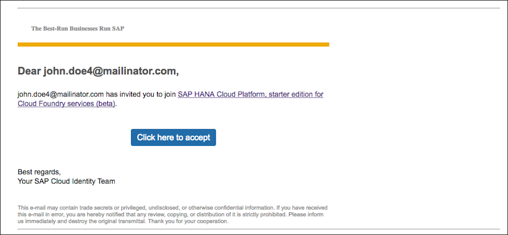
<br><br>

## 3. Access your new HCP Cloud Foundry account

You can now connect to your new Cloud Foundry organization.

1. Click the ```Manage HCP Applications``` button in the builder module. This should open the login page for the HCP Cloud Foundry administration cockpit. Alternatively, you can open the URL ```https://hcp-cockpit.cfapps.us10.hana.ondemand.com``` in the browser directly. Enter your user credentials and click ```Sign In```. You should now see the cockpit like in the screenshot below. Checkout the various options on its navigation pane.
<br><br>
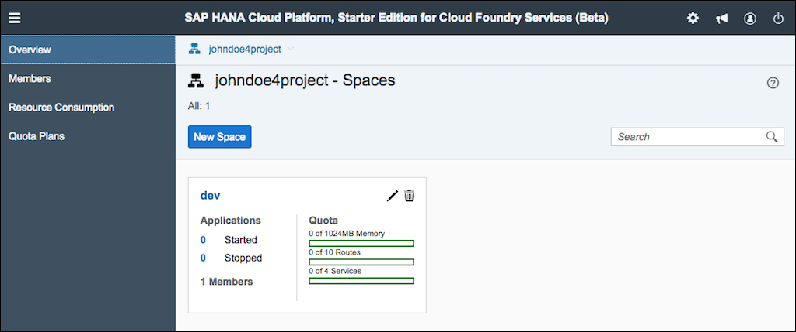
<br><br>

2. Now connect to your Cloud Foundry org through the Cloud Foundry command line tool ```cf```. Open a terminal on your computer by
pressing the Windows key and the 'R' key, then enter the command ```cmd``` into the input field and press the return key.

3. In the terminal enter ```cf api api.cf.us10.hana.ondemand.com```. You are now connected to the HCP Cloud Foundry landscape. Next, login to Cloud Foundry by entering ```cf login```. You get now prompted for your email and password. After entering your credentials, you get connected to your Cloud Foundry organization and space.
<br><br>
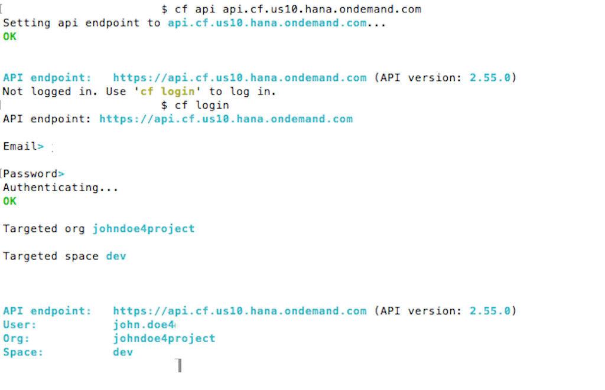
<br><br>

## Notes

You will need the command terminal further on for the following exercises. Leave the shell open and stay connected to your Cloud Foundry account.

##Summary

In this exercise you've learned how to get your own account on the HCP, starter edition for Cloud Foundry services (beta) offered in the YaaS marketplace. You are now prepared to continue with [exercise04](../exercise04).
